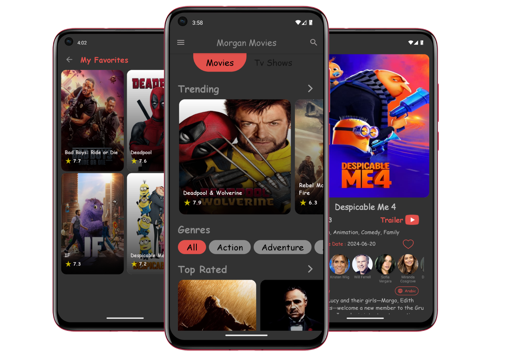
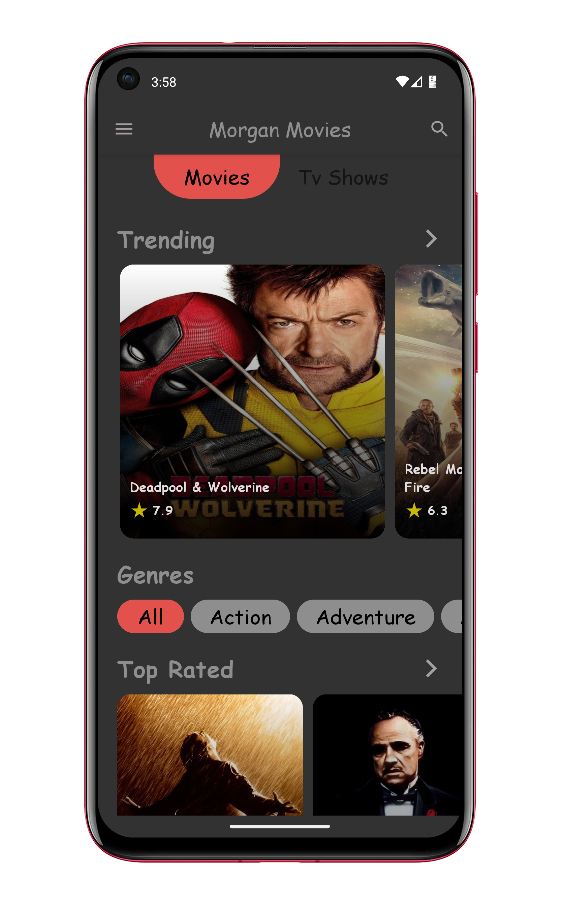
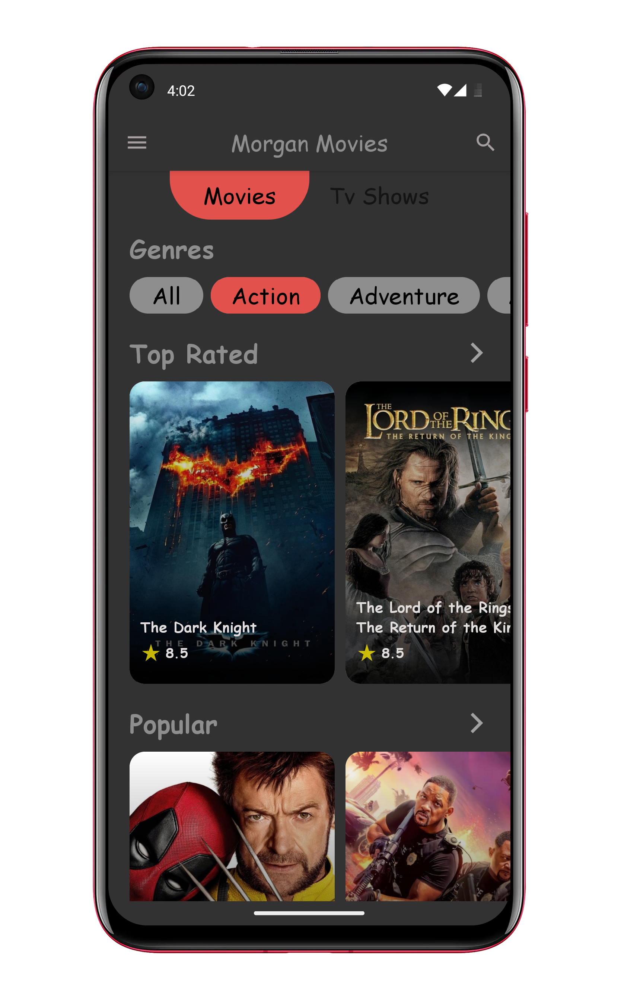
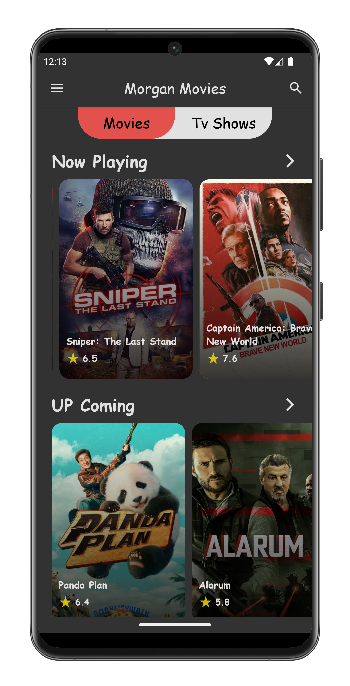
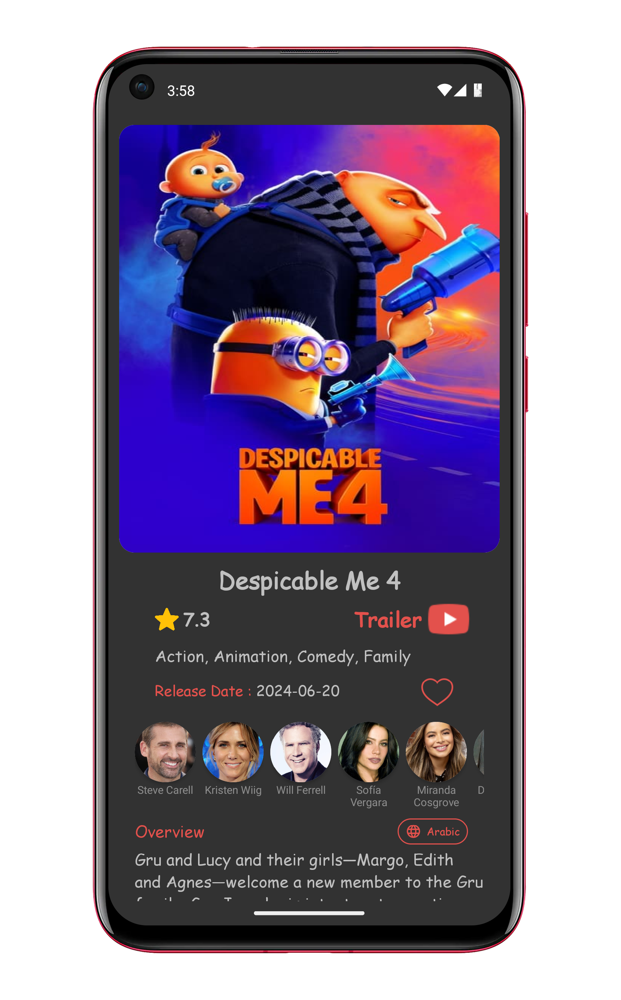
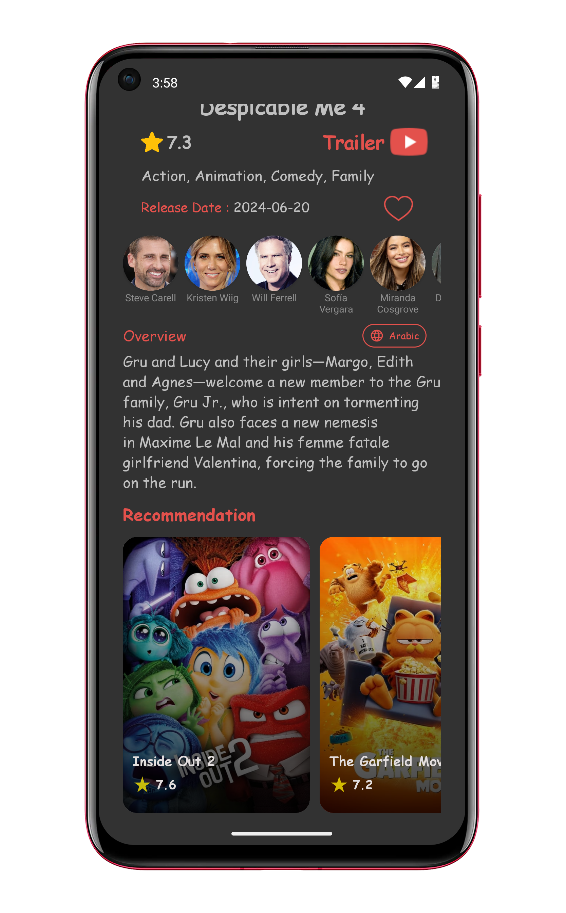
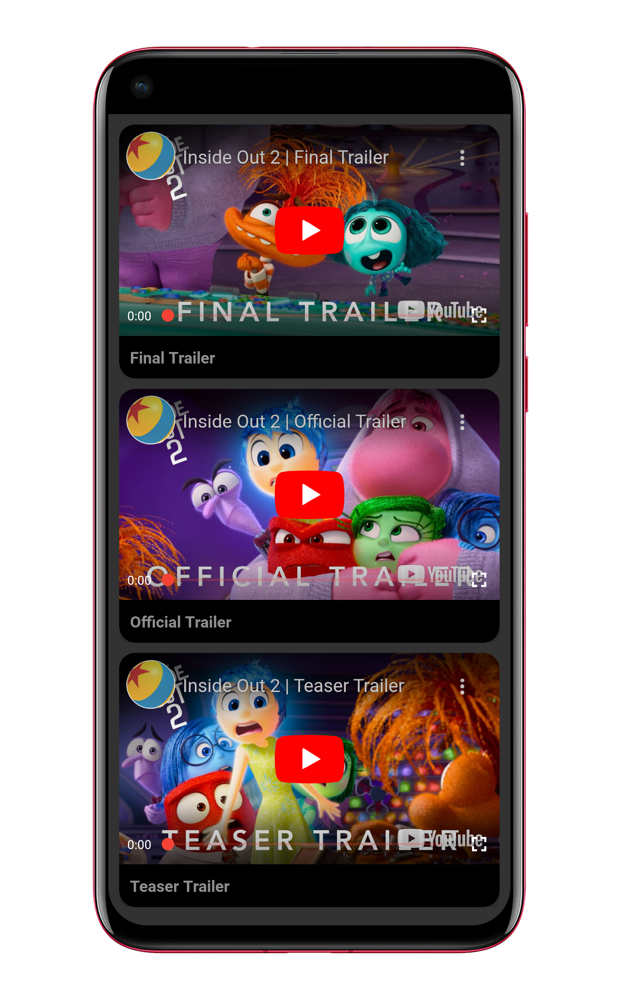
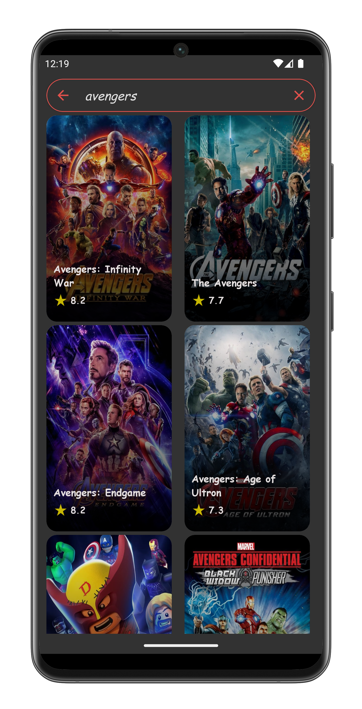
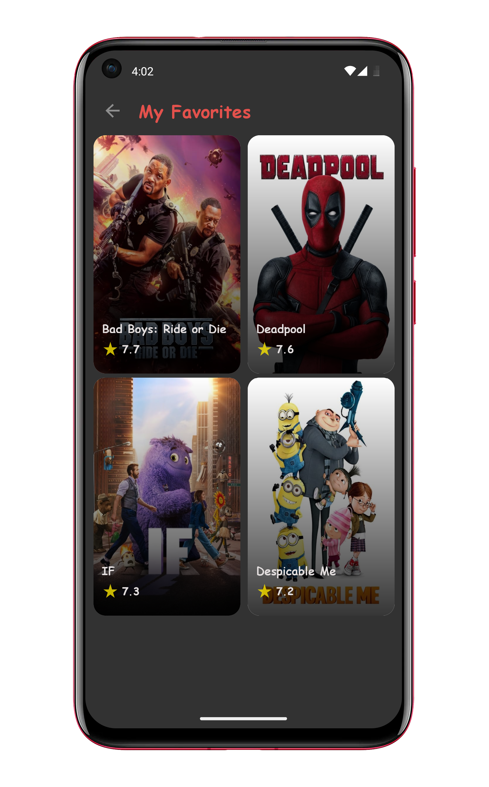

# Morgan Movies

An android app built using [kotlin](https://kotlinlang.org/docs/getting-started.html) that consumes [TMDB API](https://developers.themoviedb.org/3/getting-started/introduction) to display the current trending, upcoming, top rated, and popular movies and tv-shows. It also suggests films based on your watch list.

<p align="center">  </p>

---
# Setup Requirements
First, obtain your Bearer Token from [TMDB](https://developers.themoviedb.org/3/getting-started/introduction) and add it in a file named `local.properties` within the root directory:

```bash
API_TOKEN=**********
```
Finally, rebuild the project for changes to take effect

---
# Tech Stack

- [MVVM Architecture](https://developer.android.com/topic/architecture) - A software architecture that removes the tight coupling between components. Most importantly, in this architecture, the children don't have the direct reference to the parent, they only have the reference by observables.
- [Hilt](https://dagger.dev/hilt/) - Hilt provides a standard way to incorporate Dagger dependency injection into an Android application.
- [XML](https://developer.android.com/develop/ui/views/layout/declaring-layout)-  toolkit for building native UI.
- [Jetpack Components](https://developer.android.com/jetpack)
    - [Android KTX](https://developer.android.com/kotlin/ktx.html) - Provide concise, idiomatic Kotlin to Jetpack and Android platform APIs.
    - [AndroidX](https://developer.android.com/jetpack/androidx) - Major improvement to the original Android [Support Library](https://developer.android.com/topic/libraries/support-library/index), which is no longer maintained.
    - [Lifecycle](https://developer.android.com/topic/libraries/architecture/lifecycle) - Perform actions in response to a change in the lifecycle status of another component, such as activities and fragments.
    - [Preferences Datastore](https://developer.android.com/topic/libraries/architecture/datastore) - Jetpack DataStore is a data storage solution that allows you to store key-value pairs or typed objects with protocol buffers. DataStore uses Kotlin coroutines and Flow to store data asynchronously, consistently, and transactionally.
    - [Navigation](https://developer.android.com/guide/navigation) - Navigation refers to the interactions that allow users to navigate across, into, and back out from the different pieces of content within your app using a single activity and multiple Fragments.
    - [ViewModel](https://developer.android.com/topic/libraries/architecture/viewmodel) - Designed to store and manage UI-related data in a lifecycle conscious way. The ViewModel class allows data to survive configuration changes such as screen rotations.
- [Glide](https://github.com/bumptech/glide) - Glide is a image loading library which fetches and displays network images
- [Paging 3](https://developer.android.com/jetpack/androidx/releases/paging) - The Paging Library makes it easier for you to load data gradually and gracefully within your app.
- [Retrofit](https://square.github.io/retrofit/) - Type-safe http client and supports coroutines out of the box.
- [GSON](https://github.com/square/gson) - JSON Parser,used to parse requests on the data layer for Entities and understands Kotlin non-nullable and default parameters.
- [OkHttp Logging Interceptor](https://github.com/square/okhttp/blob/master/okhttp-logging-interceptor/README.md) - Logs HTTP request and response data.
- [Coroutines](https://github.com/Kotlin/kotlinx.coroutines) - Library Support for coroutines.
- [Flows](https://developer.android.com/kotlin/flow) - Flows are built on top of coroutines and can provide multiple values. A flow is conceptually a stream of data that can be computed asynchronously.
- [LiveData](https://developer.android.com/topic/libraries/architecture/livedata) - LiveData is an observable data holder class. It is designed to observe and react to changes in data, particularly data that is part of the user interface (UI).
- [YoutubePlayer](https://github.com/PierfrancescoSoffritti/android-youtube-player) - android-youtube-player is a stable and customizable open source YouTube player for Android. It provides a simple View that can be easily integrated in every Activity/Fragment.
- [SharedPreferences](https://developer.android.com/training/data-storage/shared-preferences) - allows you to save and require data in the form of keys and values and provides a simple method to read and write them.
---
# Screenshots

  

---
   

---
  

---
